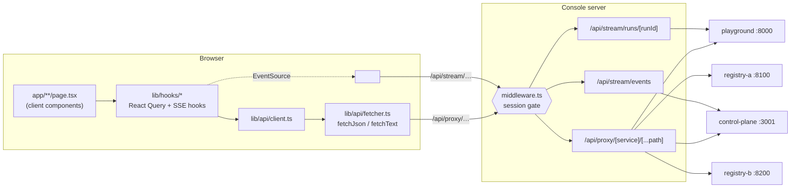
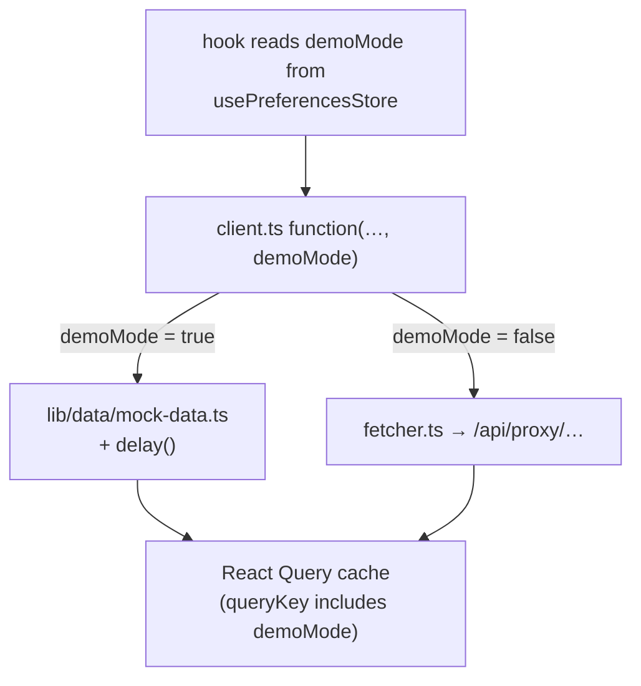
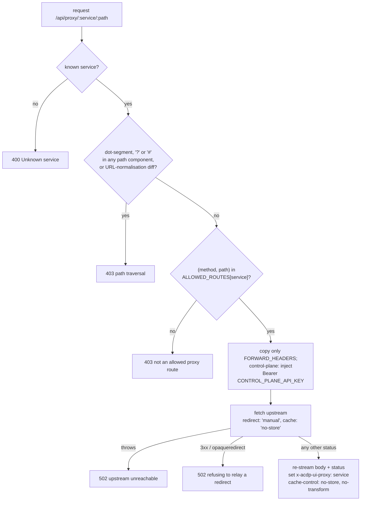
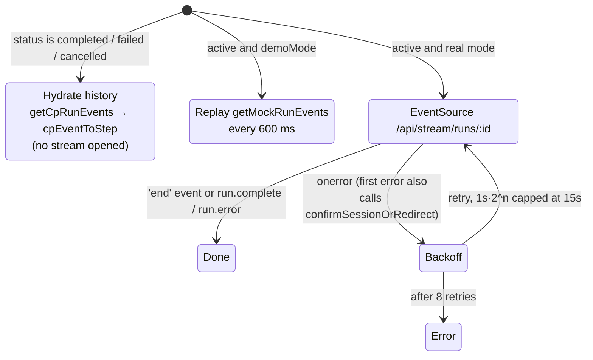

# Architecture

## Big picture

The console is a Next.js App Router app. Almost all of it runs in the browser:
every page is a client component, and none of them render server-side data.
The only server code is the root layout (`app/layout.tsx`), `app/page.tsx` (it
just redirects to `/dashboard`), the route handlers under `app/api/`, and the
root `middleware.ts`. The browser never calls a backend directly. Every
upstream call goes through one of three route trees on the console's own
origin:

| Route | File | Purpose |
|-------|------|---------|
| `/api/proxy/[service]/[...path]` | `app/api/proxy/[service]/[...path]/route.ts` | Request/response calls to the four upstreams |
| `/api/stream/runs/[runId]` | `app/api/stream/runs/[runId]/route.ts` | Relays one playground run's SSE stream |
| `/api/stream/events` | `app/api/stream/events/route.ts` | Relays the control plane's global SSE firehose |
| `/api/auth/login`, `/api/auth/logout` | `app/api/auth/*/route.ts` | Set and clear the operator session cookie ([Authentication](authentication.md)) |

The service names and their development fallback URLs come from
`lib/server/integrations.ts`. In production each `*_BASE_URL` is required, and
`getIntegrationConfig` throws if one is missing. The variables themselves are
listed in [Configuration](configuration.md).

## Demo vs real mode

Every exported function in `lib/api/client.ts` takes a `demoMode` argument and
branches on it first. In demo mode it returns data from
`lib/data/mock-data.ts` after a short simulated `delay()` and never touches
`fetcher.ts`. In real mode it calls `fetchJson`/`fetchText`, which go to the
proxy.

- The default comes from `NEXT_PUBLIC_ACDP_UI_DEMO_MODE` (anything except
  `'false'` means demo), and the operator can flip it at runtime on `/config`
  (`components/config/connection-panel.tsx`). The choice persists in
  `localStorage` through `lib/stores/preferences-store.ts`.
- Every hook puts `demoMode` in its React Query `queryKey`
  (`lib/hooks/use-runs.ts`, `use-dashboard.ts`, `use-security.ts`, …), so
  toggling it never serves one mode's cached data in the other.
- The SSE hooks never open an `EventSource` in demo mode. `use-live-run.ts`
  replays the recorded frames from `getMockRunEvents` on a 600 ms timer, and
  `use-global-events.ts` loads `listCpEvents(…, true)`.
- `confirmSessionOrRedirect` in `lib/api/fetcher.ts` returns early in demo
  mode, so a demo session can never send a real request.
- Demo mode still verifies for real. Mock contexts carry real signatures, and
  `components/contexts/context-detail.tsx` passes `MOCK_DID_DOCS` to the wasm
  verifier. See [Trust and verification](trust-and-verification.md).

## The proxy route

`app/api/proxy/[service]/[...path]/route.ts` handles every method with one
`forward` function. It is deliberately **not** a generic reverse proxy:

- **Allow-list.** `ALLOWED_ROUTES` lists the exact `(method, path-regex)`
  pairs that `lib/api/client.ts` sends for each service. Anything else gets a
  403 before any request goes out, so a guessed URL cannot reach other upstream
  routes with the injected credential attached. The two registries share one
  list, `REGISTRY_ROUTES`. The upstream routes themselves are documented in
  their own repos, linked below.
- **Request headers.** Only `FORWARD_HEADERS` reach the upstream:
  `content-type`, `accept`, `accept-language`, `idempotency-key`, `x-run-id`
  and `x-acdp-event-id`. The browser's cookies and `authorization` header are
  never forwarded. `x-tenant-id` is dropped on purpose.
- **Credential.** Only `control-plane` gets an `authorization` header, filled
  server-side from `CONTROL_PLANE_API_KEY` (`getIntegrationConfig`). The key
  never reaches the browser.
- **Error bodies are relayed as-is.** A non-2xx upstream response is
  re-streamed with its original status and body bytes, never wrapped. The
  operator-facing error copy reads the structured `errorCode` out of that body
  (`ApiError` in `lib/api/fetcher.ts`, then
  `lib/utils/api-error-messages.ts`).
- **Redirects are refused.** The 3xx range always becomes an unstamped 502 that
  names the `Location` header and the fix (point `*_BASE_URL` at the final
  URL).

### The provenance stamp

The proxy adds `x-acdp-ui-proxy: <service>` on the pass-through path only.
It never adds it to its own 400, 403 or 502 responses, and `middleware.ts`'s
401, 403 and 503 never carry it either. In `lib/api/fetcher.ts`,
`cameFromUpstream` checks that the stamp's value matches the service the call
asked about, and stores the answer as `ApiError.fromUpstream`. Two behaviours
depend on it:

- **Health wording.** `failureKind` in `lib/api/client.ts` maps a stamped
  failure to `degraded` (something past the console answered badly) and any
  other failure to `unreachable`. `pingHealth`, `useHealth`
  (`lib/hooks/use-health.ts`) and `registryProbeView`
  (`lib/hooks/use-registries.ts`) all render from this.
- **Login redirect.** `redirectToLoginOn401` sends the browser to `/login`
  only for an *unstamped* 401, the one the session gate returns. A stamped 401,
  such as a rejected `CONTROL_PLANE_API_KEY`, stays on the page as an error,
  because signing in again would not fix it.

An unstamped **2xx** should be impossible. If one arrives, `fetcher.ts` logs
one console warning per page load (`warnOnUnstampedSuccess`); it does not
throw.

## SSE relays

Both stream routes fetch upstream with `redirect: 'manual'` and pass the
response to `relayEventStream` (`lib/server/sse-relay.ts`). That function
refuses, with a 502, a 3xx, a non-2xx or bodyless response, and a 200 whose
`content-type` is not `text/event-stream`. Anything else it relays with
`cache-control: no-cache, no-transform` and `x-accel-buffering: no`. The
control-plane relay injects the same server-side bearer the proxy does; the
playground relay sends no credential. Both set `maxDuration = 60`.

`useLiveRun` (`lib/hooks/use-live-run.ts`) chooses its data source from the
run's status:

A terminal run finished before the page connected, so its stream no longer
exists. The hook loads the stored timeline from the control plane instead and
maps the control-plane event types onto the playground step types
(`CP_EVENT_TYPE`), so `EventRow` shows both the same way. The buffer is capped
at 500 events.

`useGlobalEvents` (`lib/hooks/use-global-events.ts`) opens
`/api/stream/events` and leaves reconnecting to the browser. It listens for
default messages and for the named events `context_published`,
`context_retrieved`, `context_retracted`, `context_republished` and
`search_executed`. It treats the stream as `dropped` and calls
`confirmSessionOrRedirect` only once `readyState` is `CLOSED`, meaning the
browser has given up retrying.

## Client state

- **Server state: TanStack Query.** `createQueryClient()` in
  `components/providers.tsx` sets `staleTime` 20 s, `retry: 1`, no refetch on
  window focus, and `networkMode: 'always'` for both queries and mutations,
  with `refetchOnReconnect: true` stated explicitly. Under `'always'` a query
  runs and fails honestly while the browser reports itself offline, instead of
  sitting paused, and the explicit flag keeps queries refetching on reconnect.
  Tests import the same factory.
- **Preferences: Zustand + `localStorage`.** `lib/stores/preferences-store.ts`
  holds exactly two values, `demoMode` and `jaegerUrl`. No credential is ever
  stored there; `test/__tests__/preferences-store.test.ts` pins that.
- **Polling.** `useDashboard` refetches every 30 s and `useHealth` every 15 s.
  The topbar's refresh button calls `queryClient.invalidateQueries()`.

## Source layout

| Path | What lives there |
|------|------------------|
| `app/` | Pages (one directory per route), `error.tsx` / `global-error.tsx`, and the `api/` route handlers |
| `components/` | UI grouped by domain: `layout/`, `ui/`, `dashboard/`, `scenarios/`, `runs/`, `events/`, `contexts/`, `registries/`, `trust/`, `observability/`, `config/`, `charts/` |
| `lib/api/` | `client.ts` (the demo/real branch for every call) and `fetcher.ts` (proxy wrapper, `ApiError`, provenance) |
| `lib/hooks/` | React Query hooks plus the two SSE hooks |
| `lib/verify/` | Browser-side verification on top of acdp-wasm ([Trust and verification](trust-and-verification.md)) |
| `lib/server/` | Server-only code: `integrations.ts` (upstream URLs and credentials), `session.ts`, `sse-relay.ts` |
| `lib/utils/` | Pure helpers: `revocation.ts`, `api-error-messages.ts`, `format.ts`, `acdp.ts`, `sdk-matrix.ts`, … |
| `lib/data/` | `mock-data.ts` and `mock-crypto.ts`, the full demo dataset |
| `middleware.ts` | The session gate for `/api/proxy/*` and `/api/stream/*` |

How these pieces are tested is covered in [Testing](testing.md).

## Upstream APIs (documented in their own repos)

The console only consumes these services. For their routes, payloads and
error codes, see:

- Playground: [HTTP API](https://github.com/agentcontextdistributionprotocol/acdp-playground/blob/main/docs/http-api.md) · [architecture (SSE bus, run lifecycle)](https://github.com/agentcontextdistributionprotocol/acdp-playground/blob/main/docs/architecture.md)
- Control plane: [API.md](https://github.com/agentcontextdistributionprotocol/acdp-control-plane/blob/main/docs/API.md) · [INGEST.md](https://github.com/agentcontextdistributionprotocol/acdp-control-plane/blob/main/docs/INGEST.md)
- Registry: [HTTP-API.md](https://github.com/agentcontextdistributionprotocol/acdp-registry-rs/blob/main/docs/HTTP-API.md) · [WEBHOOKS.md](https://github.com/agentcontextdistributionprotocol/acdp-registry-rs/blob/main/docs/WEBHOOKS.md)
- Error envelope and codes: [`acdp-rs` errors.md](https://github.com/agentcontextdistributionprotocol/acdp-rs/blob/main/docs/errors.md)
