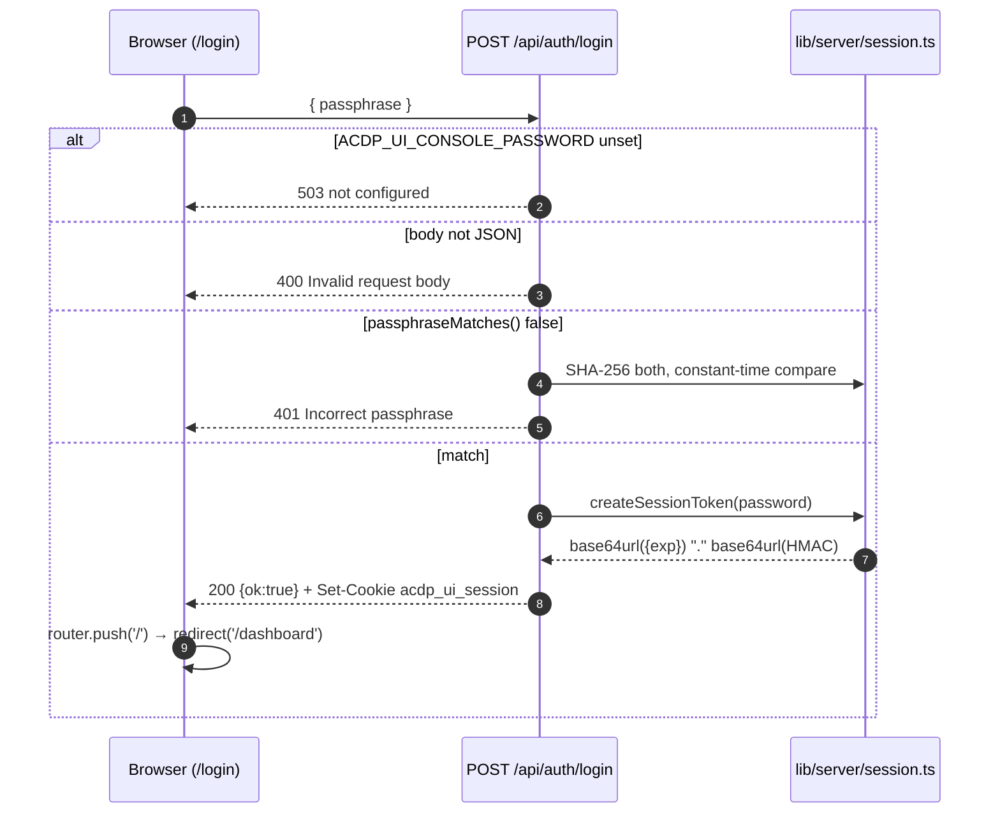
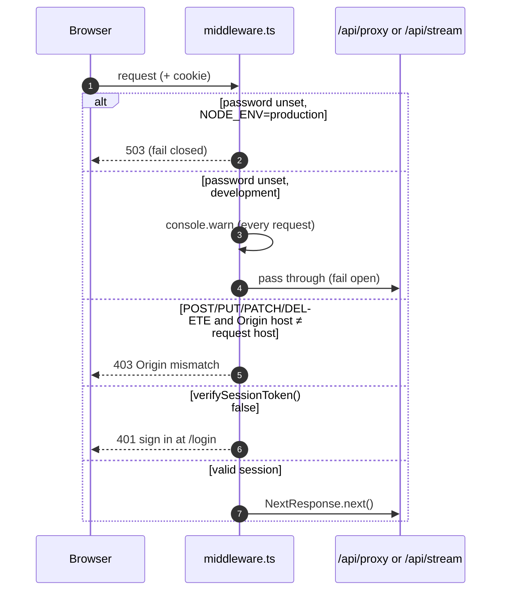
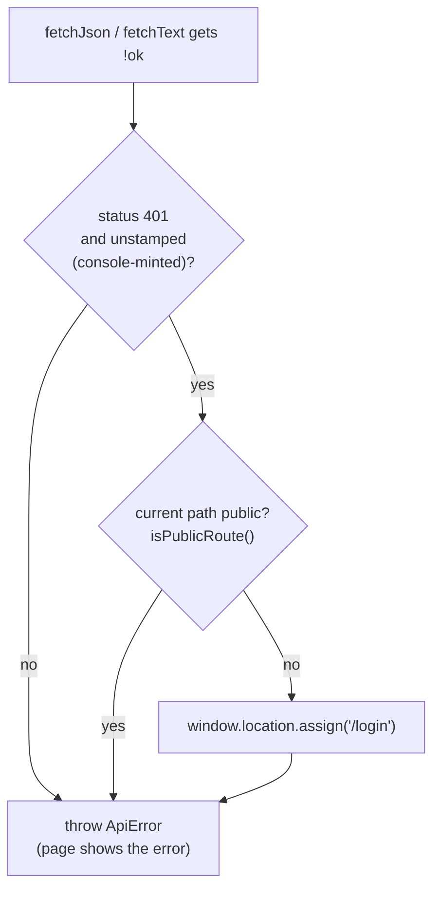

# Authentication

The console is a **single-operator** tool. It has no user accounts, only one
shared passphrase (`ACDP_UI_CONSOLE_PASSWORD`). Signing in with it sets a
signed session cookie, and `middleware.ts` checks that cookie on the
privileged routes.

This is separate from the backends' own authentication. The console reaches
the control plane with a server-side bearer token (`CONTROL_PLANE_API_KEY`),
which the proxy adds; the operator never sees it. How the control plane
issues and checks that token is documented in its
[AUTH.md](https://github.com/agentcontextdistributionprotocol/acdp-control-plane/blob/main/docs/AUTH.md).

## What is gated

```ts
// middleware.ts
export const config = { matcher: ['/api/proxy/:path*', '/api/stream/:path*'] };
```

Only the proxy and the two SSE relays are gated, never page routes. That is
enough, because the pages carry no privileged data of their own:

- Every page is a client component with no server-rendered data (`app/page.tsx`
  only redirects).
- Everything privileged has to come back through `/api/proxy/*` or
  `/api/stream/*`.

The two `/api/auth/*` routes are outside the matcher, since they are how a
session gets created in the first place.

## Signing in



- **The form.** `app/login/page.tsx` posts to `/api/auth/login` directly.
  This is one of the two allowed direct `fetch` calls outside
  `lib/api/client.ts`.
- **Error responses.** These never include the submitted or the configured
  passphrase.
- **Signing out.** `components/layout/sidebar.tsx` calls `POST
  /api/auth/logout`, which sets the cookie to empty with `maxAge: 0`, and then
  navigates to `/login`. Signing out without a cookie, as in demo mode, does
  nothing harmful.

### The cookie

Set in `app/api/auth/login/route.ts`:

| Attribute | Value |
|-----------|-------|
| Name | `acdp_ui_session` (`SESSION_COOKIE_NAME`) |
| `HttpOnly` | always |
| `Secure` | only when the request came over `https:`, so `http://localhost` still works |
| `SameSite` | `Lax` |
| `Path` | `/` |
| `Max-Age` | 12 h (`SESSION_TTL_SECONDS`) |

### The token

`lib/server/session.ts` is stateless; there is no session store.

- **Format.** The token is `base64url(JSON {exp})` + `.` + `base64url(HMAC-SHA-256)`.
- **Signing key.** The key is never the raw passphrase. It is derived with
  HKDF-SHA-256 using the salt `acdp-ui-console-session-v1` and the info string
  `acdp-ui-console-session-hmac`.
- **Verification.** `verifySessionToken` checks the token's shape, verifies
  the HMAC with `crypto.subtle.verify` (constant-time), then checks that
  `exp` is in the future. It never throws: malformed input simply returns
  `false`.
- **Runtime.** Everything uses Web Crypto, so the same code runs in the
  middleware runtime and in the Node route handlers.
- **Revoking sessions.** Changing `ACDP_UI_CONSOLE_PASSWORD` changes the
  derived key, so every existing session stops working.

## The gate on each request



- **Missing password.** The check happens on each request, never at boot. A
  production deployment that never calls the proxy, such as a pure demo
  deployment, starts fine without a password, and the privileged routes stay
  closed (503). In development the gate is off, and a warning is logged on
  every request, so the zero-setup demo still works.
- **CSRF backstop.** For requests that change state, the host in `Origin`
  must match the host the request was sent to. That host is the first entry of
  `X-Forwarded-Host` if present, otherwise `Host`, never `nextUrl.host` (see
  `resolveRequestHost` for why). A request with no `Origin` header is not
  rejected by this check. `SameSite=Lax` is the primary defence.
- **No provenance stamp.** None of the gate's responses carry
  `x-acdp-ui-proxy`, so the browser can tell them apart from an upstream's own
  401, 403 or 503 ([Architecture → The provenance stamp](architecture.md#the-provenance-stamp)).

## When a session expires mid-use



- **Which 401s redirect.** `redirectToLoginOn401` (`lib/api/fetcher.ts`)
  redirects only on a 401 that carries **no** provenance stamp, meaning the
  console's own gate sent it. A stamped 401 comes from the upstream, typically
  a wrong or rotated `CONTROL_PLANE_API_KEY`. Sending the operator to `/login`
  for that would loop, since signing in cannot fix it.
- **SSE errors.** `EventSource` errors carry no HTTP status. The SSE hooks call
  `confirmSessionOrRedirect()`, which sends one gated
  `GET /api/proxy/control-plane/healthz` and lets the rule above decide.
  `useLiveRun` does this on the first error of each connection attempt;
  `useGlobalEvents` does it only once the browser has given up retrying
  (`readyState === CLOSED`). It never runs in demo mode.
- **Public routes.** `lib/routes.ts` (`PUBLIC_ROUTES = ['/login']`,
  `isPublicRoute`) lists the pages where no session is expected. It matches
  the exact path or a sub-path, so `/login-help` is not public. It controls
  only UI behaviour: the redirect is skipped there, and the topbar does not
  poll health. It does not secure anything; `middleware.ts` does.

## Tests

| Test | Covers |
|------|--------|
| `test/__tests__/middleware.test.ts` | Fail-open/fail-closed, Origin check, `X-Forwarded-Host` handling, 401 on a bad or expired token |
| `test/__tests__/auth-route.test.ts` | Login and logout responses and cookie attributes |
| `test/__tests__/routes.test.ts` | `isPublicRoute` matches the exact path or a sub-path, not a bare prefix |
| `test/__tests__/fetcher.test.ts` | Redirecting only on an unstamped 401, and `confirmSessionOrRedirect` |
| `test/integration/global-setup.ts` | Signs in through the real `/login` form and saves the cookie as Playwright `storageState` |

How to set the passphrase and the other environment variables is in
[Configuration](configuration.md). Deployment advice, including running behind
a reverse proxy that sets `X-Forwarded-Host`, is in [Deployment](deployment.md).
