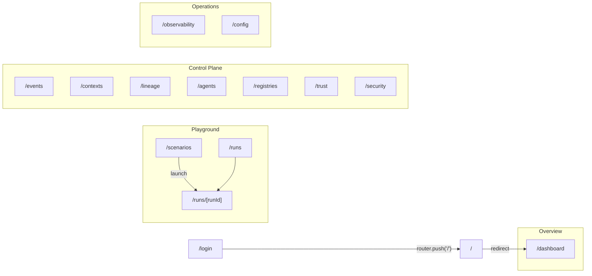

# Pages

Every route is a client component under `app/`. The one exception is
`app/page.tsx`, a server component that just calls `redirect('/dashboard')`.
Each page gets its data from hooks in `lib/hooks/` or from direct `useQuery`
calls, and each of those calls a function in `lib/api/client.ts`. That means
every page works the same way in demo mode and in real mode
([Architecture → Demo vs real mode](architecture.md#demo-vs-real-mode)).

## Navigation

`components/layout/sidebar.tsx` defines the nav groups. `/login` and
`/runs/[runId]` are not in the sidebar.

Every page shares the same shell (`components/layout/app-shell.tsx`):

- **Sidebar.** Navigation, a demo-mode indicator and a sign-out action.
- **Topbar** (`components/layout/topbar.tsx`). A breadcrumb, four health
  pills (one per service, from `useHealth`) and a refresh button that
  invalidates every query. On a public route (`isPublicRoute` in
  `lib/routes.ts`) the topbar does not render the pills, so `/login` never
  probes services that would only answer with the gate's 401.

## Route reference

The "Upstream" column names the proxied service only. For what each upstream
route returns, see that service's own docs ([links below](#upstream-reference)).

| Route | Page file | Data (hook → `client.ts`) | Upstream |
|-------|-----------|---------------------------|----------|
| `/login` | `app/login/page.tsx` | direct `fetch('/api/auth/login')` | none (console auth) |
| `/dashboard` | `app/dashboard/page.tsx` | `useDashboard` → `getCpDashboard`; `useScenarios`; `useGlobalEvents` | control-plane, playground |
| `/scenarios` | `app/scenarios/page.tsx` | `useScenarios` → `listScenarios`; `LaunchModal` → `startRun` | playground |
| `/runs` | `app/runs/page.tsx` | `useRuns` → `listCpRuns` | control-plane |
| `/runs/[runId]` | `app/runs/[runId]/page.tsx` | `useRun` → `getCpRun`; `getRunLineageGraph`; `useLiveRun` | control-plane, playground (SSE) |
| `/events` | `app/events/page.tsx` | `useInfiniteQuery` → `listCpEvents`; `useGlobalEvents` | control-plane |
| `/contexts` | `app/contexts/page.tsx` | `useInfiniteQuery` → `searchContexts`; `getContext` | registry-a/b, control-plane |
| `/lineage` | `app/lineage/page.tsx` | `useRuns`; `getRunLineageGraph`; `getLineage` | control-plane, registry-a/b |
| `/agents` | `app/agents/page.tsx` | `listAgents`; `listCpEvents({ agentId })` | control-plane |
| `/registries` | `app/registries/page.tsx` | `useRegistries` → `listRegistries`; `useRegistryCapabilities` → `getRegistryCapabilities`; `Enrollments` | control-plane, registry-a/b |
| `/trust` | `app/trust/page.tsx` | `useTrust` → `getCpDashboard` + `listCpRuns` + `getCpRun` per run | control-plane |
| `/security` | `app/security/page.tsx` | `useRevocations`, `useRegistryJwks`, `useLogWitness`, `useLogWitnessAlerts`, `useDashboard('24h')` | control-plane, registry-a/b |
| `/observability` | `app/observability/page.tsx` | `HealthChecks` → `useHealth`; `MetricsPanel` → `getCpMetrics`; `useRuns` | all four |
| `/config` | `app/config/page.tsx` | `ConnectionPanel` → `pingHealth`; `WebhookConfig` → webhook CRUD; `SdkMatrix` | all four |

## Page notes

### Dashboard

- **Time window.** A picker offers `1h`, `6h`, `24h`, `7d` and `30d`. It sets
  the `window` that `getCpDashboard` sends, and the query refetches every 30 s.
- **Content.** KPI cards, recent runs, a live event ticker
  (`useGlobalEvents`), runs-by-scenario and events-by-registry charts, and
  receipt-coverage and DID-method bars.
- **Key Revocation tile.** It renders `dashboardRevocationState(...)` from
  `lib/utils/revocation.ts`, which has four states: `reported`,
  `checked-clean`, `disabled` and `unknown`. See
  [Trust and verification](trust-and-verification.md#revocation-verdicts).

### Scenarios → run workbench

- **Launching.** `components/scenarios/launch-modal.tsx` calls `startRun` and
  navigates to `/runs/{run_id}`. The scenario catalog itself belongs to the
  playground; see its
  [scenarios.md](https://github.com/agentcontextdistributionprotocol/acdp-playground/blob/main/docs/scenarios.md).
- **The workbench.** `components/runs/run-workbench.tsx` combines
  `RunSummary`, a `RunTrustPanel` (shown only when the run has a `trust`
  summary), the live `EventFeed`, a lineage DAG (`@xyflow/react`, lazy-loaded
  through `lineage-dag-lazy.tsx`) and a `ContextInspector`. Clicking an event
  or a DAG node selects the context to inspect.
- **Lineage graph source.** The DAG uses the first of these that is available:
  the `lineage_graph` carried on stream frames, then the stored
  `getRunLineageGraph` result, then a minimal graph built from the
  `acdp.publish` events seen so far.
- **Live vs finished runs.** A run that is still active is streamed; a
  finished run loads its stored timeline. See
  [Architecture → SSE relays](architecture.md#sse-relays).

### Runs and Events

- **`/runs`.** Status filter pills (`all` or one `RunStatus`), passed to
  `useRuns({ status })`.
- **`/events`.**
  - **Filters.** Agent, registry and event type. The agent and registry fields
    are debounced (`useDebounced`).
  - **Paging.** Pages of 50, using `nextCursor` as `beforeTs`.
  - **Live toggle.** Starts `useGlobalEvents`. Live and stored events are
    merged and deduplicated by `id`.

### Contexts

`app/contexts/page.tsx` is a faceted search over the registries. The facets
are `authority` (`a`, `b` or `all`), `q`, type, domain, tags, visibility and
status.

- **Pagination.** Pages come from `useInfiniteQuery`, and "Load more" shows
  whenever `hasNextPage` is true. It does not depend on how many results the
  current page has.
- **Merged queries.** Two queries are merged in `searchContexts` and are
  therefore unpaginated: `authority: all`, and the `key-revocation` type facet,
  which searches both type spellings listed in `KEY_REVOCATION_TYPE_ALIASES`.
  A merged response sets `merged: true` and has no cursor.
- **Zero results.** The page shows one of three states: more pages remain,
  the response was merged, or there are genuinely no matches. Only the last
  says there are none.
- **Detail view.** Opening a result fetches the full context with
  `getContext` (through the control plane) and renders
  `components/contexts/context-detail.tsx`, with its in-browser verification
  chips. A failed fetch is worded by `contextErrorMessage` in
  `lib/utils/api-error-messages.ts`, the same function the run inspector
  (`components/runs/context-inspector.tsx`) uses.

### Lineage

- **"By run".** Pick a run (`useRuns`) to see its DAG
  (`getRunLineageGraph`) with the `ContextInspector`.
- **"By lineage_id".** `getLineage(lineageId, authority)` fetches the full
  version chain from one registry and renders it with
  `components/contexts/lineage-chain.tsx`. Opening an entry shows
  `ContextDetail`. Its ctx_id binding check cannot fail on this page, because
  the requested id is read from the same fetched body (see the comment in
  `app/lineage/page.tsx`).

### Agents and Registries

- **`/agents`.** Lists known agent DIDs. Selecting one loads its 20 most
  recent events.
- **`/registries`.**
  - **Cards.** One `RegistryCard` per *observed* registry
    (`listRegistries`). The header shows the result of the
    `/.well-known/acdp.json` capabilities probe, labelled by
    `registryProbeView`: `responding`, `degraded`/`unreachable`,
    `checking…` or `not probed`. It is never a hard-coded "healthy".
  - **Profile glossary.** Each card has a keyboard-reachable
    `
` "Profile glossary".
  - **Enrollments.** `components/registries/enrollments.tsx` lists
    enrollments and toggles them (admin-only). A 403 is explained with the
    shared `ADMIN_ROUTE_FORBIDDEN` copy.
- **Empty in the default stack.** In the default playground stack,
  registries do not forward webhooks, so the observed-registries list is
  legitimately empty.

### Trust and Security

- **`/trust`.**
  - **Coverage.** Deployment-wide receipt coverage and DID-method bars.
  - **Violations table.** Runs that carry a trust violation, built by
    `useTrust` (`lib/hooks/use-trust.ts`) from up to `MAX_RUNS` (25) recent
    runs.
  - **No window picker.** The window only scopes the two charts, so a picker
    would change the charts while leaving the run figures unchanged. The page
    fixes it at `24h`.
  - **Failed run reads.** If some `GET /runs/:id` reads fail, the page says
    how many and calls every figure a lower bound.
  - Details are in [Trust and verification](trust-and-verification.md#the-trust-page).
- **`/security`.** Four sections:
  - **Revocation feed.** The control-plane revocation feed, cursor-paged and
    admin-only. A 403 is explained, not treated as an outage.
  - **JWKS.** Each registry's published JWKS.
  - **Witness state.** Transparency-log witness state per observed registry
    (`components/registries/log-witness-card.tsx`).
  - **Alert worklist.** `components/registries/log-witness-alerts.tsx` lists
    alerts with an acknowledge action. Acknowledging records who and when but
    does not clear the alert. `Show acknowledged` changes which listing is
    requested.
  - **Quorum counts.** These are nullable and checked with
    `typeof x === 'number'`. Only `features.witnessQuorum === false` changes
    the wording to "disabled for this deployment".

### Observability and Config

- **`/observability`.**
  - **Health.** Per-service health (`useHealth`, which shows healthy,
    degraded or unreachable).
  - **Metrics.** Control-plane Prometheus metrics, parsed from `/metrics`
    text.
  - **Traces.** Links into Jaeger, built from the persisted `jaegerUrl` with a
    `run.id` tag search for each recent run.
- **`/config`.**
  - **ConnectionPanel.** The demo-mode toggle, a ping of each service, and the
    Jaeger URL field. These are the only two preferences the console stores.
  - **WebhookConfig.** Lists, creates, updates and deletes outbound webhooks
    on the control plane.
  - **SdkMatrix.** Version rows. For rows backed by a service the console can
    probe (`SDK_MATRIX_ROW_SERVICE` in `lib/utils/sdk-matrix.ts`: Registry A,
    Control Plane and Playground), the version comes from the live `/healthz`
    in real mode.

## Error and empty states

- **Loading, errors and empty states.** Pages use the shared primitives in
  `components/ui/`: `LoadingSkeleton`/`LoadingPanel`, `ErrorPanel` and
  `EmptyState`.
- **Error wording.** Messages come from `operatorErrorMessage` and
  `errorDiagnostic` (`lib/utils/api-error-messages.ts`), keyed by the
  upstream's exact `errorCode`.
- **Render crashes.** These land in `app/error.tsx` or
  `components/ui/error-boundary.tsx`, which both use `crashDiagnostic`. The
  last-resort `app/global-error.tsx` replaces the whole document, so it shows
  only the error digest.

## Upstream reference

- [Playground HTTP API](https://github.com/agentcontextdistributionprotocol/acdp-playground/blob/main/docs/http-api.md)
- [Control-plane API](https://github.com/agentcontextdistributionprotocol/acdp-control-plane/blob/main/docs/API.md)
- [Registry HTTP API](https://github.com/agentcontextdistributionprotocol/acdp-registry-rs/blob/main/docs/HTTP-API.md)
