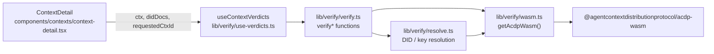
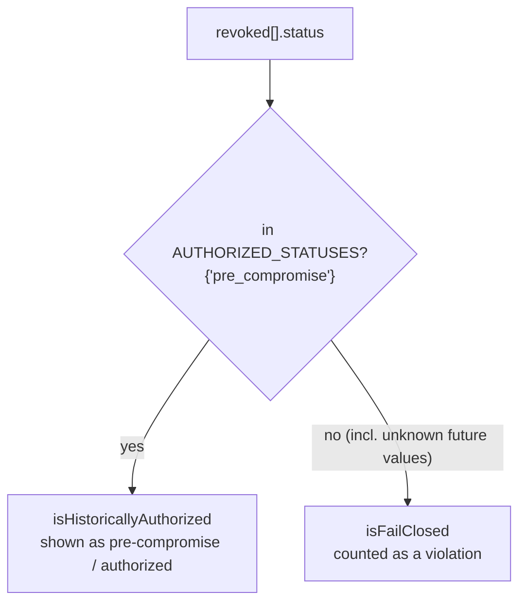
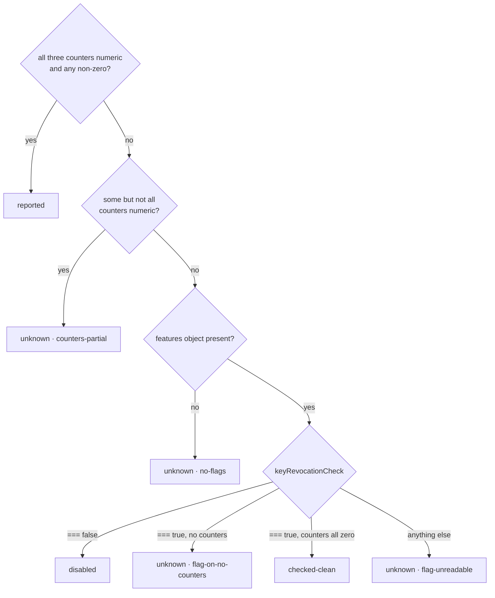

# Trust and verification

The console shows two different kinds of trust signal, and keeps them
separate:

1. **Verdicts the browser computes itself.** For a single context, the
   browser runs the ACDP WebAssembly verifier over the bytes it was served.
   This lives in `lib/verify/`.
2. **Verdicts the control plane reports.** Its receipt-audit and
   key-revocation classifications for runs and for the whole deployment are
   read, never recomputed. `lib/utils/revocation.ts` is the single place that
   interprets them, and `lib/hooks/use-trust.ts` aggregates them.

This page covers how the console runs, maps and displays these verdicts. What
each check means, and what makes it pass, is defined in the spec and the SDK
([links below](#where-the-rules-live)).

## In-browser verification (`lib/verify/`)

### Loading the wasm

`getAcdpWasm()` (`lib/verify/wasm.ts`):

- Imports the package dynamically, so it is never part of the server bundle.
- Runs `init()` once and memoises the result.
- Rejects outright outside a browser.
- Clears the memo if init fails, so the next call retries.

If init fails (for example the `.wasm` file 404s, or a MIME type or CSP
problem blocks it), `useContextVerdicts` returns an `error`. `ContextDetail`
then shows a `role="alert"` banner, so the chips never sit on "verifying…"
indefinitely.

### The checks

`useContextVerdicts` always runs the first three checks. It runs each of the
others only when the matching field is present on the `FullContext`:

| Verdict | Function | Runs when |
|---------|----------|-----------|
| `contentHash` | `verifyContentHash` | always |
| `producerSignature` | `verifyProducerSignature` | always (`unavailable` if unsigned) |
| `ctxIdBinding` | `verifyCtxIdBinding` | always |
| `registryReceipt` | `verifyRegistryReceipt` | `ctx.registry_receipt` |
| `lineageHeadReceipt` | `verifyLineageHeadReceipt` | `ctx.lineage_head_receipt` |
| `transparencyLog` | `verifyTransparencyLog` | `ctx.log_inclusion` |
| `witnessQuorum` | `verifyWitnessQuorum` | `ctx.log_inclusion.witness_signatures` is non-empty |

### Three outcomes, and "unavailable" never counts as a pass

Every check returns a `Verdict` whose `status` is one of three values:

- **`verified`.** The browser ran the check and it passed. The chip shows
  `✓ … verified`.
- **`failed`.** The browser ran the check and the material is invalid. The
  chip shows `✗ … verification failed`.
- **`unavailable`.** The browser could not run the check, either because a
  signer key or DID document is missing, or because the material could not be
  parsed. The chip is amber and reads "material only" by default. A verdict
  can supply its own `unavailableLabel` when that default wording would be
  wrong.

`VerdictChip` and `VerdictCaption` in `context-detail.tsx` render these. The
caption prints the verdict's `detail` in amber when the status is
`unavailable`, so the reason can be read without hovering.

`fromWasm` in `verify.ts` maps a wasm call that throws, or returns output it
cannot parse, to `failed` ("malformed material").
**`verifyCtxIdBinding` is the exception.** It checks the throw message
against two known prefixes, listed in `CTX_ID_BINDING_UNCHECKABLE`:

- `invalid body JSON:` becomes `unavailable` / "body not parseable".
- `invalid expected_ctx_id:` becomes `unavailable` / "requested id malformed".

Any other throw stays `failed`. An actual `{valid:false}` answer, meaning the
registry served a different context than the one requested, also stays
`failed`. `test/__tests__/wasm-fixtures.test.ts` loads the real `.wasm` binary
and pins both prefixes, so an acdp-wasm upgrade that rewords either message
fails CI instead of quietly changing behaviour.

`expectedCtxId` has to come from what the caller asked for (a search hit's
id, a URL parameter, a DAG node), never from `body.ctx_id`. `/contexts` and
the run inspector pass the requested id. On `/lineage`, the opened entry is
selected from the chain that was already fetched, so that page's check can
only ever pass (see the comment in `app/lineage/page.tsx`).

### Where keys come from

`lib/verify/resolve.ts` finds the verification keys:

- **`did:key`** is resolved entirely offline, using the wasm
  `resolveDidKey`. `resolveDidDocument` builds a DID document from the key in
  the identifier.
- **`did:web`** is resolved only from the `DidDocMap` the host passes in.
  `ContextDetail` passes `MOCK_DID_DOCS` in demo mode and **`undefined` in
  real mode**. A live `did:web` signer, registry or witness therefore comes
  out `unavailable` ("… DID document not fetched"), never as a false green.
- `verifyRegistryReceipt` needs an Ed25519 producer key to recompute the
  receipt fingerprint (`resolveEd25519Raw`). Without one it returns
  `unavailable`.

### Policy the console applies

These are the console's own display choices, not protocol rules:

- **Witness quorum.** `verifyWitnessQuorum` requires every distinct witness
  whose DID document resolves to verify (`min_witnesses` = the number of
  resolvable witnesses, at least 1). It lists unresolvable witnesses as
  skipped. If no witness resolves, quorum is `unavailable`.
- **Staleness windows.** The wasm staleness windows passed for lineage-head
  receipts and checkpoints are ten years (`315360000n` seconds).
  `context-detail.tsx` separately labels a head receipt stale after 5 minutes
  (`HEAD_RECEIPT_STALE_MS`) and a witness cosignature stale after 6 hours
  (`WITNESS_COSIG_STALE_MS`).
- **Binding chips.** Beside the cryptographic chips, `BindingChip` shows plain
  field-equality checks between the body and its receipt, head receipt or
  witnessed checkpoint: ctx, lineage, origin, content hash, head
  ctx/version, log id, tree size and root hash. These compare fields; they do
  not verify signatures.

### Recomputing when the context changes

`verificationKey()` in `use-verdicts.ts` decides when the verdicts must be
recomputed. Its rule is that every field the effect or anything it calls reads
must be part of the key. Otherwise a refetch (for example `active` becoming
`retracted`) would leave chips showing verdicts for data that is no longer on
screen. The wall clock is the one documented exception.
`test/__tests__/use-verdicts.test.ts` and
`test/__tests__/context-detail-verdicts.test.tsx` cover this.

## Control-plane verdicts (`lib/utils/revocation.ts`)

### Revocation verdicts

Each run's `trust.revoked[]` array mixes three verdict kinds.
`lib/utils/revocation.ts` sorts them through an allow-list:

Because it is an allow-list, a status this console has never seen counts as a
violation rather than as authorized. A run **has a trust violation**
(`hasTrustViolation`) when it has flagged discrepancies **or** at least one
fail-closed revocation. `/trust`'s filter, `useTrust`'s sort and
`RunTrustPanel` all call this same function.

`runRevocationReported` asks whether a run's payload shows the revocation
check ran at all. An all-zero payload is ambiguous, so `RunTrustPanel` hides
the revocation figures instead of showing confident zeros.

### Deployment-wide state on the dashboard

`dashboardRevocationState(keyRevocation, features)` turns the dashboard
payload into four states. Feature flags are compared with `=== true` or
`=== false`; a missing flag is never treated as false.

Each state, and each `unknown` reason, has its own wording on the Key
Revocation tile in `app/dashboard/page.tsx`.
`test/support/revocation-prose.ts` holds the expected text for every state,
keyed by this union, so adding a state without writing its text fails
`tsc`.

### The trust page

`useTrust` (`lib/hooks/use-trust.ts`) builds `/trust`:

1. Requests `getCpDashboard(window)` and `listCpRuns({ limit: 25 })` in
   parallel.
2. Fetches `getCpRun` for each run with `Promise.allSettled`. Each failed read
   is counted in `readFailures` instead of being silently dropped, and the
   page then calls every figure a lower bound.
3. Keeps the runs that carry a `trust` summary, sorted worst first by
   `violationCount`.
4. Adds up the per-run totals, counting fail-closed and pre-compromise
   revocations with the helpers above.

Only the receipt-coverage and DID-method charts depend on the window, so the
page fixes it at `useTrust('24h')` and offers no picker. `/security` uses
`useDashboard('24h')` the same way, to read
`features.witnessQuorum` for the witness cards
([Pages](pages.md#trust-and-security)).

## Where the rules live

- Content hash and producer signature: [RFC-ACDP-0001 (core)](https://github.com/agentcontextdistributionprotocol/agentcontextdistributionprotocol/blob/main/rfcs/RFC-ACDP-0001-core.md)
- Registry receipts: [RFC-ACDP-0010](https://github.com/agentcontextdistributionprotocol/agentcontextdistributionprotocol/blob/main/rfcs/RFC-ACDP-0010-registry-receipts.md) · registry [RECEIPTS.md](https://github.com/agentcontextdistributionprotocol/acdp-registry-rs/blob/main/docs/RECEIPTS.md)
- Lineage-head receipts: [RFC-ACDP-0011](https://github.com/agentcontextdistributionprotocol/agentcontextdistributionprotocol/blob/main/rfcs/RFC-ACDP-0011-lineage-head-receipts.md)
- Transparency log: [RFC-ACDP-0012](https://github.com/agentcontextdistributionprotocol/agentcontextdistributionprotocol/blob/main/rfcs/RFC-ACDP-0012-transparency-log.md)
- Lifecycle events: [RFC-ACDP-0013](https://github.com/agentcontextdistributionprotocol/agentcontextdistributionprotocol/blob/main/rfcs/RFC-ACDP-0013-lifecycle-events.md)
- Key revocation and the fail-closed rule: [RFC-ACDP-0014](https://github.com/agentcontextdistributionprotocol/agentcontextdistributionprotocol/blob/main/rfcs/RFC-ACDP-0014-key-revocation.md)
- Witness cosigning and quorum: [RFC-ACDP-0015](https://github.com/agentcontextdistributionprotocol/agentcontextdistributionprotocol/blob/main/rfcs/RFC-ACDP-0015-witness-cosigning.md)
- The wasm verifier's API: [`acdp-rs` bindings/acdp-wasm README](https://github.com/agentcontextdistributionprotocol/acdp-rs/blob/main/bindings/acdp-wasm/README.md) · [bindings.md](https://github.com/agentcontextdistributionprotocol/acdp-rs/blob/main/docs/bindings.md) · [consuming.md](https://github.com/agentcontextdistributionprotocol/acdp-rs/blob/main/docs/consuming.md)
- How the control plane produces receipt-audit and revocation data: [control-plane ARCHITECTURE.md](https://github.com/agentcontextdistributionprotocol/acdp-control-plane/blob/main/docs/ARCHITECTURE.md) · [CONFIGURATION.md](https://github.com/agentcontextdistributionprotocol/acdp-control-plane/blob/main/docs/CONFIGURATION.md)
